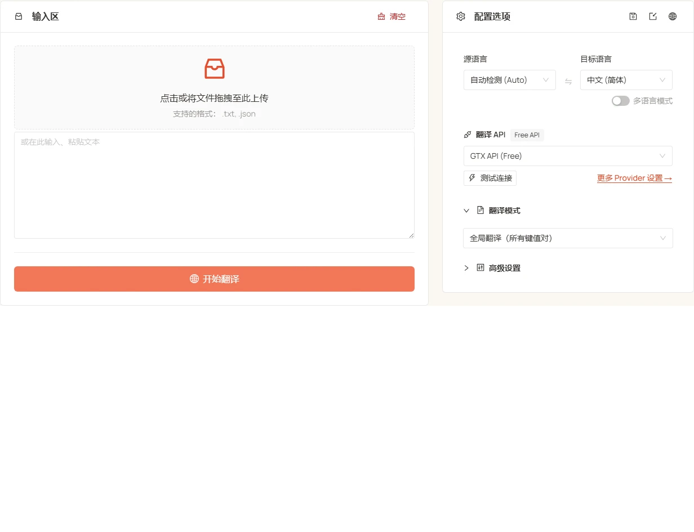

<h1 align="center">⚡️ JSON Translate</h1>
<p align="center"><a href="./README.md">English</a> | 中文</p>
<p align="center"><em>精准翻译 JSON — 只改值、不破坏结构、轻松完成 i18n</em></p>

<p align="center">
  <a href="LICENSE"></a>
  <a href="https://tools.newzone.top/zh/json-translate"></a>
</p>

**JSON Translate** 让 JSON 翻译更安全、更高效 —— 仅处理字符串值，不破坏任何结构。接入 7 种传统翻译 API（DeepL、Google、Azure、DeepLX、Qwen-MT、TranslateGemma、GTX）和 17+ 种 LLM（DeepSeek、OpenAI、Claude、Gemini 等，以及任意 OpenAI 兼容端点）。提供**全局**、**JSONPath 精准**、**指定键名**、**选择性**、**i18n 聚合** 5 种翻译模式，覆盖站点、应用、数据集的本地化场景。

👉 **在线体验**：<https://tools.newzone.top/zh/json-translate>



## 核心特性

- **保持 Schema**：仅翻译字符串值，结构、键序、类型完全不变。
- **适配 i18n 框架**：可直接用于 next-intl、i18next、vue-i18n、react-intl 文件 —— 嵌套对象、扁平 key 命名空间、ICU 占位符（`{name}`、`{count, plural, ...}`、`{0}`）均原样保留。
- **5 种翻译模式**：全局、JSONPath 精准、指定键名、选择性、i18n 聚合。
- **映射翻译**：把结果写入新键（如 `name` → `name_zh`），不覆盖原字段。
- **多语言输出**：一次翻译为多个目标语言，每个语言独立导出，或与 i18n 模式联用生成统一文件。
- **无上限缓存**（IndexedDB）：所有翻译结果本地缓存，无浏览器存储容量限制。
- **上下文关联翻译**（仅 LLM）：每批携带前后文，提升段落连贯性和术语一致性。
- **多语言界面**：基于 next-intl，支持 18 种界面语言。
- **深色模式**：内置主题切换。

## 翻译模式

### 全局翻译

递归遍历整个 JSON，翻译所有字符串值，保持层级不变。适合一次性翻译整个文件。

### 指定节点（JSONPath）

通过 JSONPath 表达式精准定位节点，多个路径用英文逗号分隔。适合在大文件中只翻译特定部分。

### 指定键名

只翻译指定的键名：

- **简单模式**：逗号分隔的键名列表
- **高级模式**：定义输入 → 输出键映射，结果写入新键，原字段保留

键名区分大小写。避免使用包含点号（`.`）的键名，会与 JSONPath 嵌套语法冲突。

### 选择性翻译

针对扁平结构：可选指定起始键，再列出要翻译的字段名。工具从起始键开始遍历所有对象，翻译命名的字段。

### i18n 模式

在原有结构中聚合多语言字段 —— 非常适合 i18n 多语言文案文件。

```json
// 源：源语言为 'en'
{ "title": { "en": "Settings" } }
```

翻译到 `zh` 和 `fr`：

```json
{
  "title": {
    "en": "Settings",
    "zh": "设置",
    "fr": "Paramètres"
  }
}
```

已存在的目标语言字段会被跳过（不会覆盖）。结合多语言输出模式，可一次性生成包含源语言和所有目标语言的统一 JSON。

## 翻译接口

### 传统翻译 API

| API 类型             | 翻译质量 | 稳定性 | 免费额度                        |
| -------------------- | -------- | ------ | ------------------------------- |
| **DeepL**            | ★★★★★    | ★★★★☆  | 每月 50 万字符                  |
| **Google Translate** | ★★★★☆    | ★★★★★  | 每月 50 万字符                  |
| **Azure Translate**  | ★★★★☆    | ★★★★★  | **前 12 个月** 每月 200 万字符  |
| **DeepLX（免费）**   | ★★★★☆    | ★★★☆☆  | 自部署或公共免费节点            |
| **Qwen-MT**          | ★★★★☆    | ★★★★☆  | 阿里云百炼（DashScope）配额     |
| **TranslateGemma**   | ★★★★☆    | ★★★★☆  | 自部署（LM Studio / Ollama 等） |
| **GTX API（免费）**  | ★★★☆☆    | ★★★☆☆  | 免费（有频率限制）              |

### AI 大模型

支持 **DeepSeek**、**OpenAI**、**Claude**、**Gemini**、**Qwen**、**Moonshot**、**Doubao**、**Zhipu GLM**、**MiniMax**、**Mistral**、**Perplexity**、**Cohere**、**OpenRouter**、**Groq**、**SiliconFlow**、**Nvidia NIM**、**Azure OpenAI**，以及任意 **Custom (OpenAI-compatible)** 端点（Ollama / LM Studio / vLLM / Together AI / Fireworks AI 等）。每个 provider 都支持自定义模型列表、temperature、system / user prompt 以及思考模式开关。

## 上下文关联翻译（仅 LLM）

LLM 模式可在每一批请求里携带前后文，提升段落级连贯性和术语一致性。

- **并发行数**：同时翻译的最大行数（默认 20）。过高可能触发速率限制。
- **上下文行数**：每批携带的上下文行数（默认 50）。值越大连贯性越好，但 token 消耗也越多。

## 技术栈

- **框架**：[Next.js 16](https://nextjs.org/)（App Router）+ React 19 with React Compiler
- **UI**：[Ant Design 6](https://ant.design/) + [Tailwind CSS 4](https://tailwindcss.com/)
- **i18n**：[next-intl](https://next-intl-docs.vercel.app/)
- **缓存**：[idb](https://github.com/jakearchibald/idb)（IndexedDB）
- **JSONPath**：[jsonpath-plus](https://github.com/JSONPath-Plus/JSONPath)

## 快速开始

### 环境要求

- Node.js >= 20.9.0
- Yarn（推荐）、npm 或 pnpm

### 安装与启动

```bash
git clone https://github.com/rockbenben/json-translate.git
cd json-translate

yarn install
yarn dev
```

打开 [http://localhost:3000](http://localhost:3000) 即可使用。

### 构建生产版本

```bash
yarn build
```

## 文档与部署

详细配置、API 设置和自托管说明，请参阅 **[官方文档](https://docs.newzone.top/guide/translation/json-translate/)**。

**快速部署**：[部署指南](https://docs.newzone.top/guide/translation/json-translate/deploy.html)

## 参与贡献

欢迎通过 Issue 或 Pull Request 参与贡献！

1. Fork 本仓库并创建功能分支
2. 本地执行 `yarn` 与 `yarn dev`
3. 适当补充测试 / 文档
4. 提交 PR 并清晰描述变更

## 许可协议

MIT © 2025 [rockbenben](https://github.com/rockbenben)。详见 [LICENSE](./LICENSE)。
