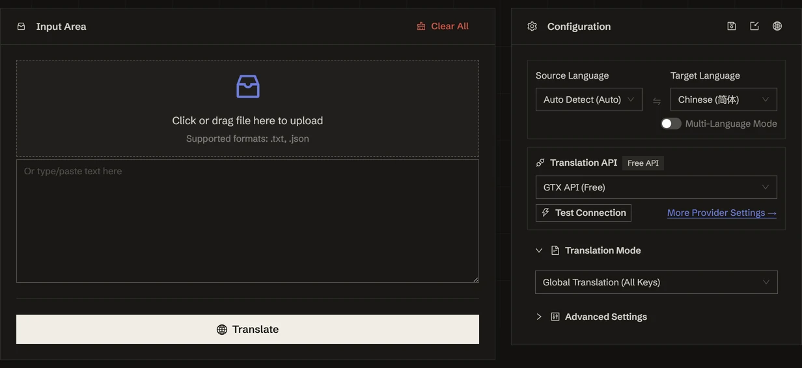

<h1 align="center">
⚡️ JSON Translate
</h1>
<p align="center">
    <em>Localize i18n JSON into 120+ languages — values only, keys and schema untouched</em>
</p>

<p align="center">
    <b>English</b> · <a href="./README.zh.md">简体中文</a>
</p>

<p align="center">
  <a href="LICENSE"></a>
  <a href="https://tools.newzone.top/en/json-translate"></a>
</p>

Feed a locale file to a general-purpose translator and it happily translates your keys too — `"submit"` becomes `"soumettre"`, your nesting collapses, and the file no longer loads. JSON Translate walks the tree locally and sends **only the string values**; keys, hierarchy, arrays, and non-string types are never in the request to begin with.

**JSON Translate** is a free, browser-based JSON localization tool for next-intl, i18next, vue-i18n, react-intl, and any other key-value structure. Five modes decide *what* gets translated — everything, a JSONPath subtree, named keys, one field across every entry, or all languages merged into one file — then connect 9 traditional translation APIs (DeepL, Google, Azure, DeepLX, Qwen-MT, TranslateGemma, MiLMMT, GTX, Edge) or 26 LLM providers and gateways and translate into 120+ languages, several at once. Everything runs locally in your browser; source content and API keys never touch a server. A [CLI](#command-line) drives the same engine headlessly when you'd rather script it.

👉 **Try it online**: <https://tools.newzone.top/en/json-translate>



## Translation Modes

Pick the mode first — it decides which values are collected. Everything else (engine, languages, glossary) is shared across all five.

| Mode | What it translates | Use it for |
| --- | --- | --- |
| **Global translation** | Every string value, at any depth | Translating a whole locale file in one go |
| **Keys under a specific node** | Values matched by JSONPath (`$.products[*].name`, `$..title`; comma-separated for several) | Large files where only a subtree needs translating |
| **Specify keys** | Only the named keys, optionally written to *different* output keys (`name` → `name_zh`) | Translating `title` / `description` while keeping the originals |
| **One field across all entries** | The same field inside every top-level entry, from an optional start key onward | Error / log catalogs where only `message` should change, `code` and `level` stay |
| **i18n mode** | Adds a field per target language beside the source-language field | Merging every language into one file |

**i18n mode** is the one worth an example. With `en` as source:

```json
{ "title": { "en": "Settings" } }
```

translating to `zh` and `fr` gives:

```json
{
  "title": {
    "en": "Settings",
    "zh": "设置",
    "fr": "Paramètres"
  }
}
```

Existing target-language fields are skipped rather than overwritten, so re-running only fills the gaps. Combined with multi-language output, one pass produces a single file holding the source and every target language.

**Structural requirements.** *One field across all entries* needs a two-level shape (entry → object); if a listed field is missing everywhere, the run aborts rather than silently skipping it. *Specify keys* is case-sensitive, and keys containing dots (`share.owner`) collide with JSONPath's nesting syntax — rename them or use another mode.

## Key Features

- **Schema-Preserving**: Only string values are collected and sent; keys, key order, nesting, arrays, numbers, booleans, and `null` are never part of the request.
- **Mapped Translation**: Write results to different output keys (`name` → `name_zh`) so the source values survive alongside the translation.
- **Multi-Language Output**: Translate into several target languages in one pass — each exported as its own file, or merged inline in i18n mode.
- **Forgiving Input**: JSON5 is accepted — trailing commas, comments, unquoted keys, single quotes — and a bare fragment without its outer `{}` / `[]` is wrapped for you.
- **Precision Warnings**: Integers beyond the IEEE-754 safe range (snowflake IDs, order numbers) and integer-like keys that a JSON round-trip re-sorts are flagged before you ship the file.
- **Glossary**: Lock brand names, SKUs, and API terms to a fixed translation — enforced in the LLM prompt and re-checked against the output, so the same term renders identically in every locale.
- **Context-Aware Translation** (LLM only): Surrounding values sent as context for better coherence and terminology consistency.
- **Unlimited Caching** (IndexedDB): Every translated value is cached locally with no browser-storage size limit — only changed strings cost an API call on the next run.
- **Command Line**: `yarn cli` runs the same engine and cache from a terminal — see [Command Line](#command-line).
- **Multi-Locale UI**: Powered by next-intl, with full UI translation across 18 languages.
- **Private by Design**: Fully client-side — source content and API keys stay in your browser; LLM requests go directly from your browser to the API endpoint you configure.

## Translation APIs

Supports **9 traditional MT APIs** and **26 LLM providers and gateways**.

### Traditional APIs

| API | Quality | Stability | Free Tier |
| --- | --- | --- | --- |
| **DeepL** | ★★★★★ | ★★★★☆ | 500K chars/month |
| **Google Translate** | ★★★★☆ | ★★★★★ | 500K chars/month |
| **Azure Translate** | ★★★★☆ | ★★★★★ | 2M chars/month (first 12 months) |
| **DeepLX (Free)** | ★★★★☆ | ★★★☆☆ | Self-host or free public endpoints |
| **Qwen-MT** | ★★★★☆ | ★★★★☆ | Alibaba DashScope quota |
| **TranslateGemma** | ★★★★☆ | ★★★★☆ | Self-host (LM Studio / llama.cpp / etc.) |
| **MiLMMT** | ★★★★☆ | ★★★★☆ | Self-host (LM Studio / llama.cpp / etc.) |
| **GTX API (Free)** | ★★★☆☆ | ★★★☆☆ | Free (rate-limited) |
| **Edge API (Free)** | ★★★★☆ | ★★★☆☆ | Free (rate-limited) |

GTX and Edge need no configuration at all — they are the zero-setup defaults, and each is the other's fallback.

### LLM Providers

**DeepSeek**, **OpenAI**, **Claude**, **Gemini**, **Qwen**, **Kimi (Moonshot)**, **Doubao (Volcengine)**, **Xiaomi MiMo**, **Zhipu GLM**, **MiniMax**, **StepFun**, **Baidu ERNIE (Qianfan)**, **Mistral**, **xAI (Grok)**, **Cohere**, and **YandexGPT**.

### Gateways

**OpenRouter**, **OpenCode Zen**, **TokenHub (Tencent)**, **Groq**, **Cerebras**, **SiliconFlow**, **Atlas Cloud**, **Nvidia NIM**, **Azure OpenAI**, plus any **Custom (OpenAI-compatible)** endpoint (Ollama / LM Studio / vLLM / LiteLLM / Together AI / Fireworks AI etc.).

Providers walled off from browsers by CORS can be routed through an API relay. The built-in relay works out of the box; **API Settings → Relay address** points every relayed provider at your own deployment of the relay Worker instead.

LLM modes give you:

- **Best for**: long values (product copy, tutorials, help text), and anything where terminology has to stay consistent
- **Customization**: configure system / user prompts to lock in terminology and tone
- **Temperature Control**: adjust AI creativity (0–1 scale)
- **Thinking Mode**: per-provider toggle for reasoning-capable models

## Context-Aware Translation (LLM only)

LLM modes can send surrounding values as context for each batch, improving coherence and terminology consistency across a locale file.

- **Concurrent Lines**: max values translated in parallel (default 20). Too high triggers rate limits.
- **Context Lines**: values included per batch as context (default 50). Higher = better coherence but more tokens.

## FAQ

**Machine translation or LLM?** Pick by value length. Short UI strings — button labels, menu items, error messages — come out fine on machine translation, and GTX / Edge cost nothing. Longer values (product descriptions, onboarding copy, help text) read markedly better on an LLM: DeepSeek is the value pick, Claude Sonnet is the most reliable on terminology.

**Does it work with next-intl, i18next, vue-i18n, and react-intl?** Yes — nested objects, flat-key namespaces, and arrays are all handled, because the tool works on the parsed tree rather than on a framework-specific schema. Keys are never sent to the engine.

**What about ICU placeholders like `{name}` or `{count, plural, ...}`?** They live inside the value, so they do go to the engine. Most engines leave them alone; if one starts rewriting them, put the placeholder in the glossary as a source → target pair and the leak-through net restores it after translation.

**How do I translate only some fields?** Use *Specify keys* for named keys, *Keys under a specific node* for a JSONPath subtree, or *One field across all entries* when every entry has the same shape. Mapped translation writes results to new keys so the originals survive.

**Will my key order change?** Only for integer-like keys (`"1"`, `"42"`). A JSON round-trip re-sorts those ahead of string keys — that's a language-level rule, not a bug in the tool — and the UI warns you when a file contains them.

**Is it private?** Yes. Parsing, translation, and caching all run client-side. API keys are stored only in local browser storage, and LLM requests go directly from your browser to your configured endpoint.

See the [full FAQ in the docs](https://docs.newzone.top/en/guide/translation/json-translate/) for more.

## Command Line

`yarn cli` translates files headlessly over the **same** engine as the web app — same retry and rate-limit handling, same cache keys. Configure the service once in the browser, hit **Export settings**, and hand the JSON to the CLI; nothing has to be re-entered.

The CLI has no mode picker: it translates **every string value in the file**, which is what locale-file batches want. Reach for the web app when you need JSONPath targeting, key mapping, or i18n merging.

```bash
yarn install   # once

# Several locale files into Chinese on the free GTX API — no key, no config.
yarn cli -i en.json -i errors.json -t zh

# Two targets in one pass, using your exported keys/prompts/glossary.
yarn cli -i messages/en.json -t ja -t ko -s ~/json-settings.json -o messages/

# A local model — nothing leaves the machine.
yarn cli -i en.json -t zh -m llm --url http://localhost:11434/v1 --model qwen3

# One-off override on top of a settings file.
yarn cli -i en.json -t de -m deepseek --api-key sk-xxx
```

Output lands beside the input (or in `-o <dir>`) as `en.zh.json`.

| Option | Meaning |
| --- | --- |
| `-i, --input <file>` | Input file. Repeatable. |
| `-t, --to <lang>` | Target language. Repeatable. Default `zh`. |
| `-f, --from <lang>` | Source language. Default `auto`. |
| `-m, --method <id>` | Service id. Default `gtxFreeAPI`; `--list-methods` prints them all. |
| `-s, --settings <file>` | Settings JSON exported from the web UI (keys, prompts, glossary, retry…). |
| `-o, --out-dir <dir>` | Output directory. Default: next to each input. |
| `--api-key` · `--url` · `--model` | One-off overrides for the chosen service. |
| `--no-cache` · `--cache-file <file>` | Cache control. Default `~/.translate-cli-cache.json`. |
| `--relay` · `--no-relay` | Route through the API relay. Off by default — Node has no CORS to work around. |
| `--format <fmt>` | Force a format instead of inferring it from the extension. |

⚠️ The CLI requires **strict JSON**. The web app additionally accepts JSON5 (trailing commas, comments); a hand-edited locale file that translates fine in the browser will be rejected here rather than silently rewritten.

JSON is not the only input: the same command handles subtitles (`.srt`, `.ass`, `.vtt`, `.lrc`, `.sbv` — timecodes stripped locally) and Markdown (`.md`, `.markdown`, `.mdx` — code blocks, links, and LaTeX protected by default). `yarn cli --list-formats` prints the mapping, `yarn cli --help` the full option list.

Runs are resumable: every translated value is cached, so re-running after a `Ctrl-C`, a rate-limit wall, or a handful of failed values only pays for what is still missing.

Exit codes: `0` everything translated · `1` finished but some values soft-failed (kept as source text in the output) or a file failed · `2` bad invocation · `130` cancelled.

## Run It Yourself

Node.js >= 20.9.0 and Yarn (or npm / pnpm).

```bash
git clone https://github.com/rockbenben/json-translate.git
cd json-translate

yarn install
yarn dev        # http://localhost:3000
yarn build      # production build
```

## Documentation & Deployment

For detailed configuration, API setup, and self-hosting instructions, see the **[Official Documentation](https://docs.newzone.top/en/guide/translation/json-translate/)**.

**Quick Deployment**: [Deploy Guide](https://docs.newzone.top/en/guide/translation/json-translate/deploy.html)

## Contributing

Contributions are welcome! Feel free to open issues and pull requests.

1. Fork the repo and create a feature branch
2. Run `yarn` and `yarn dev` locally
3. Add tests / docs when applicable
4. Submit a PR with a clear description
