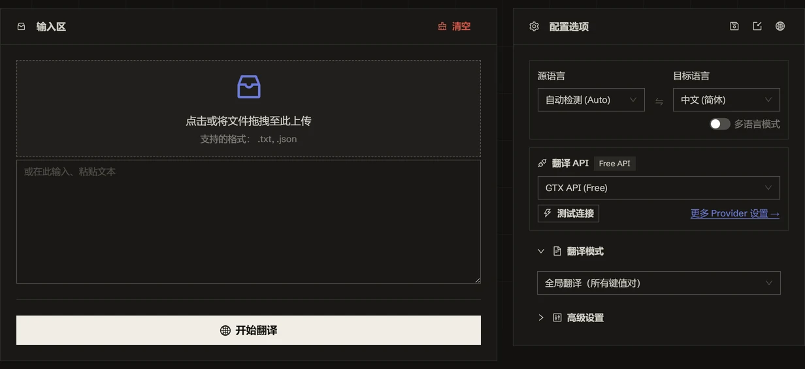

<h1 align="center">
⚡️ JSON Translate
</h1>
<p align="center">
    <em>把 i18n JSON 翻成 120+ 种语言，只动值，键名与结构分毫不改</em>
</p>

<p align="center">
    <a href="./README.md">English</a> · <b>简体中文</b>
</p>

<p align="center">
  <a href="LICENSE"></a>
  <a href="https://tools.newzone.top/zh/json-translate"></a>
</p>

把语言文件丢进通用翻译器，它会连键名一起翻掉——`"submit"` 变成 `"提交"`、嵌套层级散架，文件直接加载不了。JSON 翻译器在本地遍历整棵树，**只把字符串值**发出去；键名、层级、数组与非字符串类型压根不在请求里。

**JSON Translate** 是一款免费、纯浏览器运行的 JSON 本地化工具，适配 next-intl、i18next、vue-i18n、react-intl 以及任何键值结构。五种模式决定*翻哪些内容*——全量、JSONPath 子树、指定键名、每条记录里的同一个字段、或把所有语言合并进一份文件——再接入 9 种传统翻译 API（DeepL、Google、Azure、DeepLX、Qwen-MT、TranslateGemma、MiLMMT、GTX、Edge）和 26 种 LLM 与网关，覆盖 120+ 种语言，可一次翻译多种。全程在浏览器本地完成，原文与 API Key 不经过服务器。想脚本化批处理，还有一个共用同一套引擎的[命令行工具](#命令行)。

👉 **在线体验**：<https://tools.newzone.top/zh/json-translate>



## 翻译模式

先选模式——它决定哪些值会被收集。其余部分（引擎、语言、术语表）五种模式共用。

| 模式 | 翻译的内容 | 适用场景 |
| --- | --- | --- |
| **全局翻译（所有键）** | 任意深度的全部字符串值 | 整份语言文件一次翻完 |
| **指定节点下的键** | JSONPath 命中的值（`$.products[*].name`、`$..title`；多条用逗号分隔） | 大文件里只需要翻某个子树 |
| **指定键名（支持多个）** | 只翻列出的键，可写入*另一个*输出键（`name` → `name_zh`） | 只翻 `title` / `description` 且保留原值 |
| **所有条目的同一字段** | 每条顶层记录内部的同名字段，可从指定起始键往后 | 错误 / 日志表里只翻 `message`，`code`、`level` 不动 |
| **i18n 模式（合并语言）** | 在源语言字段旁追加各目标语言字段 | 把所有语言合并进同一份文件 |

**i18n 模式**值得单独举例。以 `en` 为源语言：

```json
{ "title": { "en": "Settings" } }
```

翻译成 `zh` 与 `fr` 后得到：

```json
{
  "title": {
    "en": "Settings",
    "zh": "设置",
    "fr": "Paramètres"
  }
}
```

已存在的目标语言字段会被跳过而不是覆盖，所以重跑只补缺口。配合多语言输出，一次运行即可产出同时包含源语言与全部目标语言的单份文件。

**结构要求**：*所有条目的同一字段* 需要两层结构（条目 → 对象）；列出的字段若在所有条目里都不存在，整轮会报错中止而不是静默跳过。*指定键名* 区分大小写；键名里含点（`share.owner`）会与 JSONPath 的嵌套语法冲突——请改名或换用其他模式。

## 核心特性

- **结构无损**：只收集并发送字符串值；键名、键顺序、嵌套、数组、数字、布尔值与 `null` 从不进入请求。
- **映射翻译**：把结果写进另一个输出键（`name` → `name_zh`），原值与译文并存。
- **多语言输出**：一次可翻译成多种目标语言——各自导出为独立文件，或在 i18n 模式下合并写回同一份。
- **输入宽容**：支持 JSON5——尾逗号、注释、无引号键名、单引号——缺最外层 `{}` / `[]` 的片段也会自动补上。
- **精度提醒**：超出 IEEE-754 安全范围的整数（雪花 ID、订单号），以及会被 JSON 往返重排到前面的整数样式键，都会在导出前提示。
- **术语表**：把品牌名、SKU、API 术语锁定为固定译法——在 LLM 提示词里强制，并对输出再校验一次，同一术语在每个语言文件里译法一致。
- **上下文关联翻译**（仅 LLM）：每批携带相邻值作为上下文，连贯性与术语一致性更好。
- **无上限缓存**（IndexedDB）：每个译好的值都本地缓存，无浏览器存储容量限制——下次重跑只有改动过的字符串才消耗 API 调用。
- **命令行**：`yarn cli` 在终端跑同一套引擎与缓存，详见[命令行](#命令行)。
- **多语言界面**：基于 next-intl，支持 18 种界面语言。
- **隐私优先**：完全前端处理——原文与 API Key 仅保存在浏览器；LLM 请求直接从浏览器发往你配置的 API 端点。

## 翻译接口

支持 **9 种传统翻译 API** 和 **26 种 LLM 与网关**。

### 传统翻译 API

| API 类型 | 翻译质量 | 稳定性 | 免费额度 |
| --- | --- | --- | --- |
| **DeepL** | ★★★★★ | ★★★★☆ | 每月 50 万字符 |
| **Google Translate** | ★★★★☆ | ★★★★★ | 每月 50 万字符 |
| **Azure Translate** | ★★★★☆ | ★★★★★ | **前 12 个月** 每月 200 万字符 |
| **DeepLX（免费）** | ★★★★☆ | ★★★☆☆ | 自部署或公共免费节点 |
| **Qwen-MT** | ★★★★☆ | ★★★★☆ | 阿里云百炼（DashScope）配额 |
| **TranslateGemma** | ★★★★☆ | ★★★★☆ | 自部署（LM Studio / llama.cpp 等） |
| **MiLMMT** | ★★★★☆ | ★★★★☆ | 自部署（LM Studio / llama.cpp 等） |
| **GTX API（免费）** | ★★★☆☆ | ★★★☆☆ | 免费（有频率限制） |
| **Edge API（免费）** | ★★★★☆ | ★★★☆☆ | 免费（有频率限制） |

GTX 与 Edge 完全免配置，是开箱即用的默认项，且互为备胎。

### AI 大模型

**DeepSeek**、**OpenAI**、**Claude**、**Gemini**、**Qwen**、**Kimi（Moonshot）**、**Doubao 豆包**、**Xiaomi MiMo**、**Zhipu GLM**、**MiniMax**、**StepFun 阶跃星辰**、**Baidu ERNIE 文心（千帆）**、**Mistral**、**xAI (Grok)**、**Cohere**、**YandexGPT**。

### 聚合网关

**OpenRouter**、**OpenCode Zen**、**TokenHub（腾讯）**、**Groq**、**Cerebras**、**SiliconFlow**、**Atlas Cloud**、**Nvidia NIM**、**Azure OpenAI**，以及任意 **Custom (OpenAI-compatible)** 端点（Ollama / LM Studio / vLLM / LiteLLM / Together AI / Fireworks AI 等）。

被 CORS 挡住浏览器直连的服务可走 API 中转。内置中转开箱即用；**API 设置 → 中转地址** 可把所有开了中转的服务一次性指向你自建的那份中转 Worker。

LLM 模式提供：

- **适用场景**：长值（产品文案、教程、帮助文本），以及任何需要术语统一的内容
- **可定制**：支持配置 system / user prompt，锁定术语与语气
- **温度控制**：调节 AI 创造性（0–1）
- **思考模式**：对推理类模型，可按 provider 单独开关

## 上下文关联翻译（仅 LLM）

LLM 模式可在每一批请求里携带相邻值作为上下文，提升整份语言文件的连贯性与术语一致性。

- **并发行数**：同时翻译的最大条数（默认 20）。过高可能触发速率限制。
- **上下文行数**：每批携带的上下文条数（默认 50）。值越大连贯性越好，但 token 消耗也越多。

## 常见问题

**用机器翻译还是 AI 大模型？** 按值的长度选。按钮文案、菜单项、报错提示这类短 UI 字符串，机器翻译足够，GTX / Edge 还不花钱。产品描述、引导文案、帮助文本这类长值，大模型明显更自然：性价比首选 DeepSeek，术语稳定性首选 Claude Sonnet。

**支持 next-intl、i18next、vue-i18n、react-intl 吗？** 都支持。嵌套对象、扁平键名命名空间、数组都能处理——因为工具作用在解析后的树上，而不是某个框架的特定 schema。键名从不发给引擎。

**`{name}`、`{count, plural, ...}` 这类 ICU 占位符呢？** 它们在值内部，所以确实会随值发给引擎。多数引擎不会动它们；万一某个引擎开始改写，把占位符作为「源 → 目标」条目加进术语表，译后的兜底替换会把它还原回来。

**只想翻部分字段怎么做？** 键名固定用 *指定键名*，子树用 *指定节点下的键*，每条记录形状一致时用 *所有条目的同一字段*。映射翻译会把结果写进新键，原值保留。

**翻译后键顺序会变吗？** 只有整数样式的键（`"1"`、`"42"`）会变。JSON 往返会把它们重排到字符串键之前——这是语言层面的规则，不是工具的问题——文件里含这类键时界面会提示。

**隐私安全吗？** 安全。解析、翻译、缓存全程在浏览器内完成；API Key 仅保存在本地浏览器，LLM 请求直接从浏览器发往你配置的端点。

更多说明见 [官方文档完整 FAQ](https://docs.newzone.top/guide/translation/json-translate/)。

## 命令行

`yarn cli` 在终端里跑的是**同一套**引擎——同样的重试与限流处理、同样的缓存键。在浏览器里配好服务后点「导出设置」，把那份 JSON 交给 CLI 即可，无需重填任何配置。

CLI 没有模式选择器：它翻译**文件里的每一个字符串值**，这正是语言文件批处理想要的行为。需要 JSONPath 定位、键映射或 i18n 合并时，用网页端。

```bash
yarn install   # 只需一次

# 多份语言文件翻成中文，走免费 GTX，无需 key、无需配置
yarn cli -i en.json -i errors.json -t zh

# 一次两种目标语言，复用导出的 key / 提示词 / 术语表
yarn cli -i messages/en.json -t ja -t ko -s ~/json-settings.json -o messages/

# 本地模型，数据不出本机
yarn cli -i en.json -t zh -m llm --url http://localhost:11434/v1 --model qwen3

# 在设置文件基础上临时覆盖
yarn cli -i en.json -t de -m deepseek --api-key sk-xxx
```

产物默认写在输入文件旁边（或 `-o <dir>`），命名为 `en.zh.json`。

| 选项 | 说明 |
| --- | --- |
| `-i, --input <file>` | 输入文件，可重复 |
| `-t, --to <lang>` | 目标语言，可重复，默认 `zh` |
| `-f, --from <lang>` | 源语言，默认 `auto` |
| `-m, --method <id>` | 翻译服务，默认 `gtxFreeAPI`；`--list-methods` 列出全部 |
| `-s, --settings <file>` | 网页端导出的设置 JSON（密钥、提示词、术语表、重试参数等） |
| `-o, --out-dir <dir>` | 输出目录，默认与输入同目录 |
| `--api-key` · `--url` · `--model` | 针对当前服务的临时覆盖 |
| `--no-cache` · `--cache-file <file>` | 缓存控制，默认 `~/.translate-cli-cache.json` |
| `--relay` · `--no-relay` | 是否走 API 中转。默认关闭——Node 端没有 CORS 需要绕 |
| `--format <fmt>` | 强制指定格式，不按扩展名推断 |

⚠️ CLI 只接受**严格 JSON**。网页端额外支持 JSON5（尾逗号、注释）；手改过的语言文件在浏览器里能翻，在这里会被直接拒绝，而不是静默改写。

不止 JSON：同一条命令也处理字幕（`.srt`、`.ass`、`.vtt`、`.lrc`、`.sbv`，时间轴在本地剥离）和 Markdown（`.md`、`.markdown`、`.mdx`，默认保护代码块、链接与 LaTeX）。`yarn cli --list-formats` 查看格式映射，`yarn cli --help` 查看完整选项。

翻译可续跑：每个译好的值都进缓存，`Ctrl-C` 中断、撞上限流、或只有少数几个值失败后再跑一次，只会为还缺的那部分付费。

退出码：`0` 全部译完 · `1` 跑完但有值软失败（输出里保留原文）或有文件失败 · `2` 参数错误 · `130` 已取消。

## 自行部署

需要 Node.js >= 20.9.0 与 Yarn（或 npm / pnpm）。

```bash
git clone https://github.com/rockbenben/json-translate.git
cd json-translate

yarn install
yarn dev        # http://localhost:3000
yarn build      # 构建生产版本
```

## 文档与部署

详细配置、API 设置和自托管说明，请参阅 **[官方文档](https://docs.newzone.top/guide/translation/json-translate/)**。

**快速部署**：[部署指南](https://docs.newzone.top/guide/translation/json-translate/deploy.html)

## 参与贡献

欢迎通过 Issue 或 Pull Request 参与贡献！

1. Fork 本仓库并创建功能分支
2. 本地执行 `yarn` 与 `yarn dev`
3. 适当补充测试 / 文档
4. 提交 PR 并清晰描述变更
